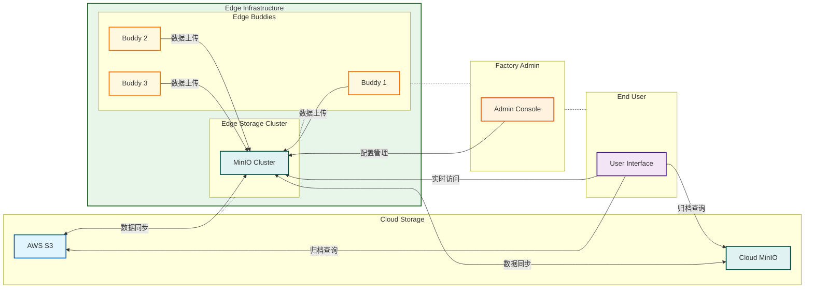

# EdgeTwin Provision 构造图

```mermaid
flowchart LR
  %% 定义样式
  classDef cloud fill:#e1f5fe,stroke:#01579b,stroke-width:2px
  classDef edge fill:#e8f5e9,stroke:#1b5e20,stroke-width:2px
  classDef admin fill:#fff3e0,stroke:#e65100,stroke-width:2px
  classDef user fill:#f3e5f5,stroke:#4a148c,stroke-width:2px
  classDef storage fill:#e0f2f1,stroke:#004d40,stroke-width:2px
  classDef buddy fill:#fff8e1,stroke:#ff6f00,stroke-width:2px

  %% Cloud - 左上角
  subgraph CLOUD [Cloud Storage]
    A[AWS S3]
    CM[Cloud MinIO]
  end
  class A,CLOUD cloud
  class CM,StoreCluster storage


  %% Edge Storage Cluster - 左侧中部
  subgraph StoreCluster ["Edge Storage Cluster"]
      M["MinIO Cluster"]
  end
  class M,StoreCluster storage

  %% Edge Buddies - 中央
  subgraph BUDDIES ["Edge Buddies"]
    B1[Buddy 1]
    B2[Buddy 2]
    B3[Buddy 3]
  end
  class B1,B2,B3,BUDDIES buddy

  %% 整个Edge区域 - 包含存储和Buddies
  subgraph Edge ["Edge Infrastructure"]
    StoreCluster
    BUDDIES
  end
  class Edge edge

  %% Factory Admin - 右上角
  subgraph AdminDiv ["Factory Admin"]
    Admin[Admin Console]
  end
  class Admin,AdminDiv admin

  %% End User - 右下角
  subgraph EndUser ["End User"]
    U[User Interface]
  end
  class U,EndUser user

  %% 关系
  A <--->|数据同步| M
  CM <--->|数据同步| M

  B1 -->|数据上传| M
  B2 -->|数据上传| M
  B3 -->|数据上传| M
  Admin -->|配置管理| M
  U -->|实时访问| M
  U -->|归档查询| A
  U -->|归档查询| CM

  %% 调整布局位置
  CLOUD -.- StoreCluster
  StoreCluster -.- BUDDIES
  BUDDIES -.- AdminDiv
  AdminDiv -.- EndUser
```

