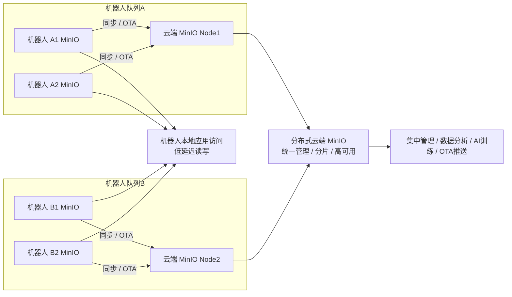
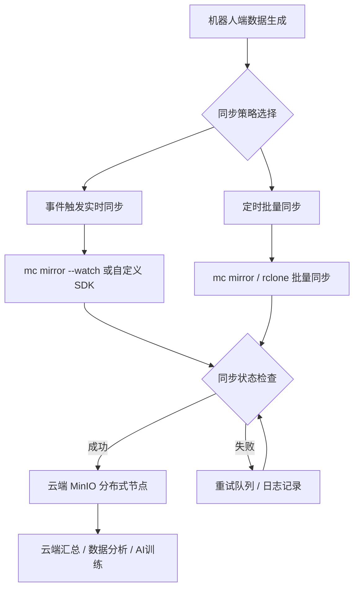
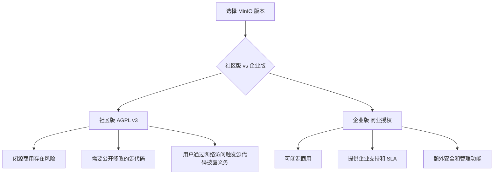

# 机器人领域 MinIO 数据存储与同步方案

## 1. 背景与目标

- **背景**：
  - 移动机器人、无人车和AGV在工作过程中会产生大量数据：
    - 传感器数据（LiDAR、IMU、GPS）
    - 视频/图像流
    - 日志和状态信息
    - 地图和导航数据
  - 数据既需要在机器人本地快速访问，也需要上传云端进行集中管理、分析和优化算法。
- **目标**：
  1. 机器人本地 MinIO 提供低延迟存储和缓存能力
  2. 云端 MinIO 提供集中存储、分析、备份能力
  3. 支持实时关键数据同步、批量上传和断点续传
  4. 支持多机器人、多场景部署，方便统一管理

---

## 2. 系统架构

### 多机器人 & 分布式云端示意



---

## 3. 机器人端 MinIO

- **用途**：缓存和本地访问、支持离线运行  
- **特点**：
  - 单节点部署，低资源占用
  - 支持高速 SSD/HDD
  - 提供 S3 API，方便 ROS/RTOS 或其他应用直接调用
- **核心功能**：
  - 数据写入和本地查询
  - 事件触发同步或批量同步
  - 支持版本管理和对象锁（防止误删除关键数据）
  - 本地缓存地图、日志和模型文件

---

## 4. 云端 MinIO

- **用途**：集中存储、分析、算法训练、OTA推送  
- **特点**：
  - 分布式部署，保证高可用
  - 支持多机器人并行上传
  - 与机器人端 S3 接口兼容
- **核心功能**：
  - 数据汇总、备份和分析
  - 支持批量和增量同步
  - 分发 OTA 更新（地图、模型、软件）

---

## 5. 数据同步策略

### 同步方式选择

| 方案 | 优点 | 缺点 | 适用场景 |
|------|------|------|----------|
| mc mirror | 官方支持，简单 | 无队列，网络中断需重试 | 小到中型机器人队列 |
| rclone | 灵活，可限速、增量 | 配置稍复杂 | 大量数据或复杂同步策略 |
| 自定义 SDK | 可控队列、分片、断点续传 | 开发成本高 | 大规模机器人场景 |
| MinIO Gateway + Replication | 原生 S3 replication | 需云端支持 | 企业级 OTA / 数据复制 |

### 同步模式



---

## 6. 安全与管理

- **身份认证**：
  - 每台机器人独立 Access Key / Secret Key
- **传输加密**：
  - TLS / HTTPS
- **存储加密**：
  - MinIO SSE-S3 / SSE-C
- **访问控制**：
  - 桶策略或 IAM 控制不同机器人组权限
- **数据完整性**：
  - 对象校验和，确保同步数据正确
- **审计日志**：
  - 同步状态、异常、重试次数记录

---

## 7. 技术实现示例

### 机器人端定时同步到云端（Shell 脚本）

```bash
#!/bin/bash
# 配置别名
mc alias set cloud-minio https://minio.cloud.example.com CLOUD_KEY CLOUD_SECRET
mc alias set robot-minio http://127.0.0.1:9000 ROBOT_KEY ROBOT_SECRET

# 同步数据（地图、日志、传感器数据）
mc mirror --overwrite --remove --parallel 4 robot-minio/robot-data cloud-minio/robot-data >> /var/log/minio-sync.log 2>&1
```

### Crontab 定时任务示例

```bash
# 每天凌晨 2 点同步
0 2 * * * /usr/local/bin/mc mirror --overwrite --remove robot-minio/robot-data cloud-minio/robot-data >> /var/log/minio-sync.log 2>&1
```

---

## 8. 机器人端 MinIO 商用许可风险



- **社区版 AGPL v3 风险**：
  - 修改或提供网络访问服务时需公开源代码
  - 闭源商用可能违反许可
- **企业版风险低**：
  - 商业授权允许闭源部署
  - 企业级支持、SLA、额外安全功能

---

## 9. 优势总结

1. **低延迟 + 可离线访问**  
   - 机器人端 MinIO 保证实时访问和断网可用
2. **多机器人集中管理**  
   - 云端 MinIO 集群汇总数据，用于分析、AI训练和 OTA
3. **兼容性好**  
   - S3 API 统一接口，第三方应用和 ROS 节点可直接访问
4. **灵活同步策略**  
   - 实时增量 + 批量全量 + 失败重试
5. **安全可靠**  
   - TLS、加密、权限控制、完整性校验、审计日志
6. **支持 OTA 推送**  
   - 云端可分发地图、模型和软件更新到机器人端

---

## 10. 未来扩展

- 支持跨区域多云环境部署  
- 数据压缩和分片优化带宽  
- 异常事件驱动的实时同步策略优化  
- 自动监控、告警和同步状态可视化

