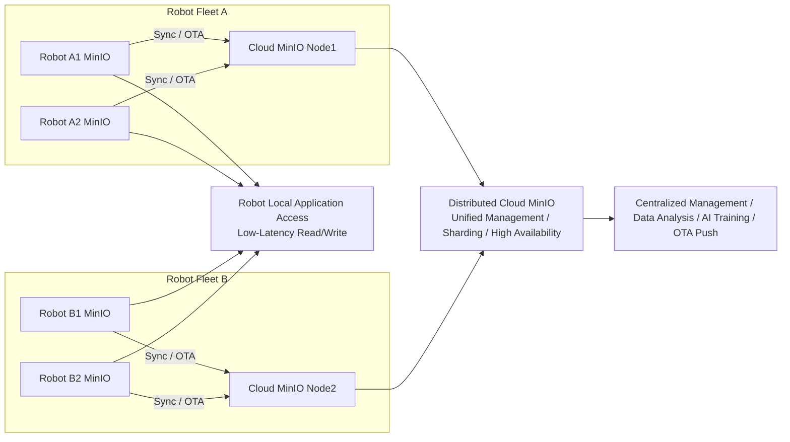
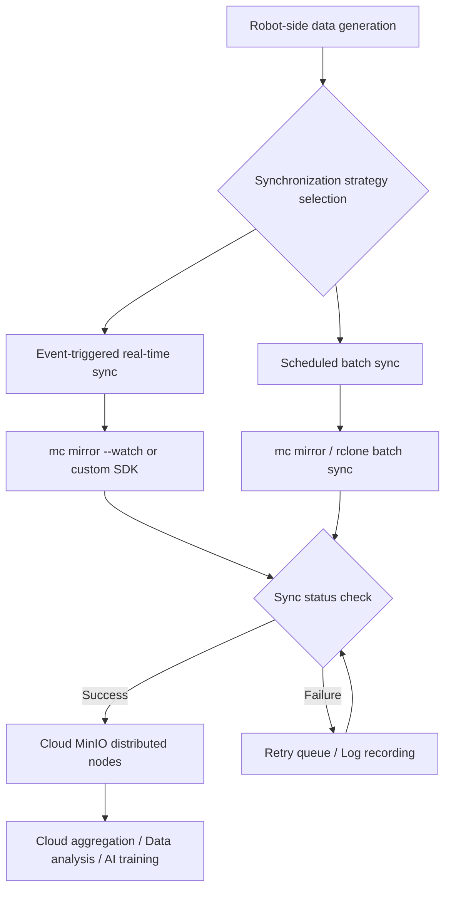
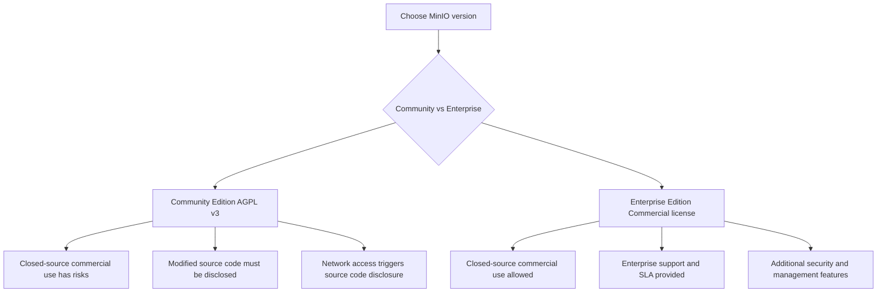

# Robot Domain MinIO Data Storage and Synchronization Solution

## 1. Background and Objectives

- **Background**:
  - Mobile robots, autonomous vehicles, and AGVs generate large amounts of data during operation:
    - Sensor data (LiDAR, IMU, GPS)
    - Video/image streams
    - Logs and status information
    - Maps and navigation data
  - Data needs to be quickly accessed locally on the robot and uploaded to the cloud for centralized management, analysis, and algorithm optimization.
- **Objectives**:
  1. Local MinIO on robots provides low-latency storage and caching capabilities
  2. Cloud MinIO provides centralized storage, analysis, and backup capabilities
  3. Support real-time critical data synchronization, batch uploads, and resumable transfers
  4. Support multi-robot, multi-scenario deployments for unified management

---

## 2. System Architecture

### Multi-Robot & Distributed Cloud Diagram



---

## 3. Robot-side MinIO

- **Purpose**: Caching and local access, supporting offline operation  
- **Features**:
  - Single-node deployment, low resource consumption
  - Support for high-speed SSD/HDD
  - Provides S3 API for easy integration with ROS/RTOS or other applications
- **Core Functions**:
  - Data writing and local querying
  - Event-triggered synchronization or batch synchronization
  - Support for version management and object locking (preventing accidental deletion of critical data)
  - Local caching of maps, logs, and model files

---

## 4. Cloud-side MinIO

- **Purpose**: Centralized storage, analysis, algorithm training, OTA pushing  
- **Features**:
  - Distributed deployment, ensuring high availability
  - Support for parallel uploads from multiple robots
  - Compatible with robot-side S3 interface
- **Core Functions**:
  - Data aggregation, backup, and analysis
  - Support for batch and incremental synchronization
  - Distribution of OTA updates (maps, models, software)

---

## 5. Data Synchronization Strategy

### Synchronization Method Selection

| Solution | Advantages | Disadvantages | Applicable Scenarios |
|------|------|------|----------|
| mc mirror | Official support, simple | No queue, network interruption requires retry | Small to medium robot fleets |
| rclone | Flexible, speed limiting, incremental | Slightly complex configuration | Large data volumes or complex sync strategies |
| Custom SDK | Controllable queue, sharding, resumable transfers | High development cost | Large-scale robot scenarios |
| MinIO Gateway + Replication | Native S3 replication | Requires cloud support | Enterprise-level OTA / data replication |

### Synchronization Modes



---

## 6. Security and Management

- **Identity Authentication**:
  - Independent Access Key / Secret Key for each robot
- **Transport Encryption**:
  - TLS / HTTPS
- **Storage Encryption**:
  - MinIO SSE-S3 / SSE-C
- **Access Control**:
  - Bucket policies or IAM to control permissions for different robot groups
- **Data Integrity**:
  - Object checksums, ensuring synchronized data correctness
- **Audit Logs**:
  - Recording of synchronization status, anomalies, retry counts

---

## 7. Technical Implementation Examples

### Robot-side Scheduled Synchronization to Cloud (Shell Script)

```bash
#!/bin/bash
# Configure aliases
mc alias set cloud-minio https://minio.cloud.example.com CLOUD_KEY CLOUD_SECRET
mc alias set robot-minio http://127.0.0.1:9000 ROBOT_KEY ROBOT_SECRET

# Synchronize data (maps, logs, sensor data)
mc mirror --overwrite --remove --parallel 4 robot-minio/robot-data cloud-minio/robot-data >> /var/log/minio-sync.log 2>&1
```

### Crontab Scheduled Task Example

```bash
# Synchronize at 2 AM daily
0 2 * * * /usr/local/bin/mc mirror --overwrite --remove robot-minio/robot-data cloud-minio/robot-data >> /var/log/minio-sync.log 2>&1
```

---

## 8. Commercial License Risks for Robot-side MinIO



- **Community Edition AGPL v3 Risks**:
  - Source code must be disclosed when modified or providing network access service
  - Closed-source commercial use may violate the license
- **Enterprise Edition Lower Risk**:
  - Commercial license allows closed-source deployment
  - Enterprise-level support, SLA, additional security features

---

## 9. Summary of Advantages

1. **Low Latency + Offline Access**  
   - Robot-side MinIO ensures real-time access and availability during network outages
2. **Centralized Management of Multiple Robots**  
   - Cloud MinIO cluster aggregates data for analysis, AI training, and OTA
3. **Good Compatibility**  
   - Unified S3 API interface, third-party applications and ROS nodes can access directly
4. **Flexible Synchronization Strategies**  
   - Real-time incremental + Batch full + Failure retry
5. **Secure and Reliable**  
   - TLS, encryption, access control, integrity verification, audit logs
6. **OTA Push Support**  
   - Cloud can distribute map, model, and software updates to robot-side

---

## 10. Future Extensions

- Support for cross-region multi-cloud environment deployment  
- Data compression and sharding to optimize bandwidth  
- Optimization of anomaly event-driven real-time synchronization strategies  
- Automatic monitoring, alerting, and synchronization status visualization
        